<div align="center">

<a href="https://github.com/lipelf/lipelf/blob/main/README.md"></a>
<a href="https://github.com/lipelf/lipelf/blob/main/README.en.md"></a>





<a href="https://www.luizfellipe.com.br/"></a>

</div>


## `> cat about-me.md`

I'm a Backend Developer at **LM Sistemas**, where I build and maintain scalable REST APIs with **Node.js**, **NestJS**, **TypeScript** and **PostgreSQL**, applying **Clean Architecture** principles.

Previously I worked in **test automation QA at Thomson Reuters** (Playwright, Selenium, Cucumber/BDD) and on **applied AI** development with OpenAI API integration. Advanced English (C1) — developed during a J-1 exchange program in the United States.

> [!NOTE]
> I believe well-built technology transforms businesses and impacts lives.


## `> ls ./stack`

<div align="center">

<a href="#"></a>

</div>

<table>
<tr>
<td valign="top" width="25%">

**⚙️ Backend**


</td>
<td valign="top" width="25%">

**🗄️ Database & ORM**


</td>
<td valign="top" width="25%">

**🧪 Testing & QA**


</td>
<td valign="top" width="25%">

**🧰 Others**


</td>
</tr>
</table>


## `> git log --experience`

```diff
+ Apr 2026 – present    Jr. Backend Developer              LM Sistemas · Criciúma, SC, Brazil
! Dec 2025 – Mar 2026   Food Runner (J-1 Exchange)         The Highlands · Harbor Springs, USA
# Mar – Dec 2025        QA Intern — Test Automation        Thomson Reuters Brazil · Criciúma, SC
# Oct 2024 – Mar 2025   AI Developer / Product Owner       Ema Sistemas · Criciúma, SC
# Nov 2023 – May 2024   Front-End Intern                   La Moda · Criciúma, SC
```

<details>
<summary><b>🎓 Education</b> &nbsp;·&nbsp; <b>🌐 Languages</b> <i>(click to expand)</i></summary>

<br/>

**B.Sc. in Computer Science** · Unesc — Universidade do Extremo Sul Catarinense  
February 2023 – June 2027 *(in progress)*

- 🇧🇷 Portuguese — native
- 🇺🇸 English — advanced (C1) · J-1 Exchange Program, USA
- 🇪🇸 Spanish — basic

</details>


## `> ./freelance --info`

Alongside my work at LM Sistemas, **I take on freelance projects**: APIs, backends, complete web systems and integrations. Some are already live:

| Project | Type | Stack |
|---|---|---|
| [**Fábrica de Sonhos**](https://fabricasonho.com.br) | Fullstack | NestJS · TypeORM · Next.js · TypeScript |
| **Lovvier** | Backend | NestJS · TypeScript |

<p align="center">
  <a href="https://www.luizfellipe.com.br/">
    
  </a>
</p>


## `> ./contact.sh`

<p align="center">
  <a href="https://www.luizfellipe.com.br/">
    
  </a>
  <a href="mailto:luizfrs2004@gmail.com">
    
  </a>
  <a href="https://linkedin.com/in/luiz-felliperocha-dos-santos-028145165">
    
  </a>
</p>

<p align="center">
  
  
</p>

<p align="center">
  
</p>
